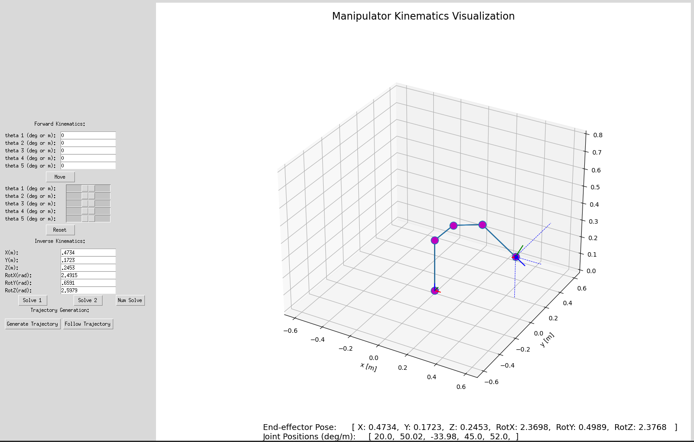
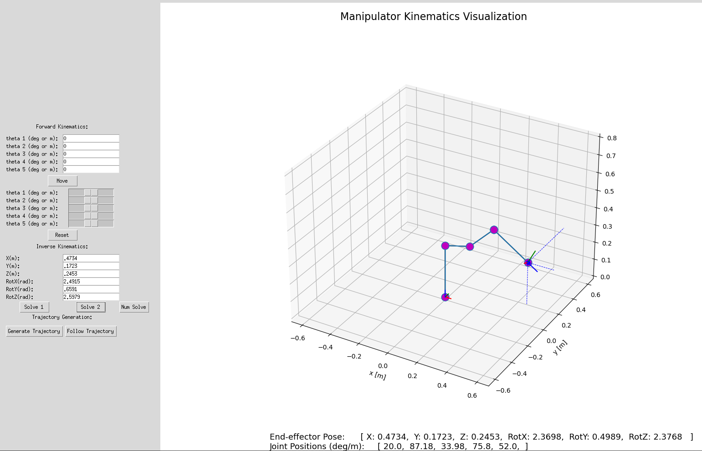
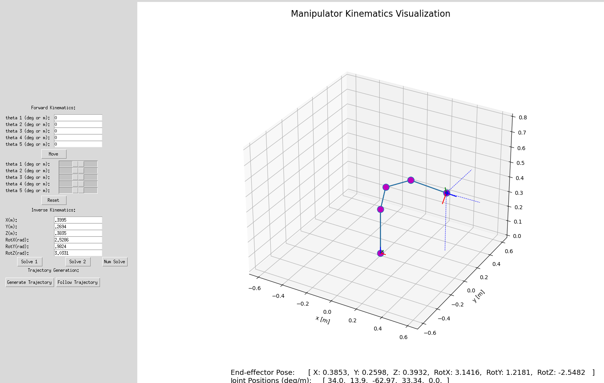

# Fundamentals of Robotics Mini Project 2
## Mika Gazit, Charlie Mawn

### Overview
This repo is specifically used to visualize the numerical and analytical inverse kinematics for a 5-dof robot.

### How to Run the Visualizer for Inverse Kinematics
To successfully run the visualizer, First install all necessary packages:
```
pip install -r requirements.txt
```

Then, to launch the visualizer tool, (changing `python` to suit the utilized python environment) using:
```
python main_arm.py --robot_type 5-dof
```

For best results, start with inputting angles to the forwards kinematics solver - this ensures that the position you input for the inverse kinematics has at least 1 valid solution. 

Once the visualizer has moved to your desired angles, find the corresponding end effector position and rotation - see image below for where those are found.

Input those values into the inverse kinematics solver. Do not round the values! Put them in as they appear on screen. Click "Solve 1" or "Solve 2" to use two different analytical solutions, or click "Num Solve" to solve it numerically.

### Implementation Images
For accuracy: compare the inputs in the solver to the outputs at the bottom of the screen. 

Analytical IK (Solution 1)

Analytical IK (Solution 2)

Numerical IK


### Extra
For more resources on using the visualizer, see [this repo](https://github.com/OlinCollege-FunRobo/arm-kinematics-module). 

The visualizer only shows 2 possible solutions for the analytical method - however, our code finds all of the possible solutions. If you would like to see those, running the code will print out a list of all possible solutions in your terminal. 

